# Process Flow
{: .no_toc }

## Table of contents
{: .no_toc .text-delta }

1. TOC
{:toc}

These flowcharts represent the internal process of the `repver` tool. They illustrate how the tool operates and the sequence of operations it performs internally.  This is best used as a reference for developers and contributors to understand the flow of the tool and is not necessary for a user to understand this process.

## Initialization Phase

```mermaid
flowchart TD
    %% Initial configuration loading and parameter verification
    Start((Start)) --> DConfigExists{.repver exist?}
    DConfigExists -- Yes --> PLoadConfig[Load .repver]
    DConfigExists -- No --> ENoConfig[Error 100<br>.repver file not found]
    ENoConfig --> EndNoConfig((End))
    
    PLoadConfig --> DLoadSuccess{Load Success?}
    DLoadSuccess -- Yes --> PValidateConfig[Validate .repver]
    DLoadSuccess -- No --> ELoadFailed[Error 101<br>.repver failed to load]
    ELoadFailed --> EndLoadFailed((End))
    
    PValidateConfig --> DValidateSuccess{Validation Successful?}
    DValidateSuccess -- No --> EValidateFailed[Error 102<br>.repver validation failed]
    EValidateFailed --> EndValidateFailed((End))
    DValidateSuccess -- Yes --> PCommandArgs[Enumerate possible command line arguments from .repver]
    
    PCommandArgs --> PParseFlags[Parse command line arguments]
    PParseFlags --> DCommandSpecified{Command specified?}
    DCommandSpecified -- Yes --> PGetCommand[Retrieve command configuration]
    DCommandSpecified -- No --> ENoCommand[Error 103<br>No command specified]
    ENoCommand --> EndNoCommand((End))
    
    PGetCommand --> DCommandFound{Command found?}
    DCommandFound -- Yes --> PVerifyParams[Identify required arguments for command]
    DCommandFound -- No --> ECommandNotFound[Error 104<br>Command not found]
    ECommandNotFound --> EndCommandNotFound((End))
    
    PVerifyParams --> DParamsProvided{All params provided?}
    DParamsProvided -- No --> EMissingParams[Error 105<br>Missing required parameters]
    EMissingParams --> EndMissingParams((End))
    DParamsProvided -- Yes --> DGitOptionsProvided{Git options provided?}

    DGitOptionsProvided -- Yes --> DInGitRepo{In git repo?}
    DGitOptionsProvided -- No --> ExecPhase((Execution Phase))
    
    DInGitRepo -- No --> ENoGitRepo[Error 106<br>Not in git repository]
    ENoGitRepo --> EndNoGitRepo((End))
    DInGitRepo -- Yes --> DGitClean{Git workspace clean?}
    
    DGitClean -- No --> EGitNotClean[Error 107<br>Git workspace not clean]
    EGitNotClean --> EndGitNotClean((End))
    DGitClean -- Yes --> ExecPhase
    
    %% Style definitions
    classDef startStyle fill:#d9f99d;
    classDef endStyle fill:#fecaca;
    classDef processStyle fill:#bfdbfe;
    classDef decisionStyle fill:#ddd6fe;
    
    %% Apply styles
    class Start startStyle;
    class EndNoConfig,EndLoadFailed,EndValidateFailed,EndNoCommand,EndCommandNotFound,EndMissingParams,EndNoGitRepo,EndGitNotClean endStyle;
    class PLoadConfig,PValidateConfig,PCommandArgs,PParseFlags,PGetCommand,PVerifyParams,ExecPhase processStyle;
    class DConfigExists,DLoadSuccess,DValidateSuccess,DCommandSpecified,DCommandFound,DParamsProvided,DGitOptionsProvided,DInGitRepo,DGitClean decisionStyle;
```

## Execution Phase

```mermaid
flowchart TD
    ExecPhase((Execution Phase)) --> DGitOptionsSpecified{Git options specified?}
    DGitOptionsSpecified -- Yes --> PGetCurrentBranch[Get current branch name]
    DGitOptionsSpecified -- No --> DHasTargets{Has targets to update?}
    
    PGetCurrentBranch --> DCreateBranch{Create new branch?}
    DCreateBranch -- Yes --> PBuildBranchName[Build branch name]
    DCreateBranch -- No --> DHasTargets
    
    PBuildBranchName --> DBranchExists{Branch already exists?}
    DBranchExists -- Yes --> EBranchExists[Error 200<br>Branch already exists]
    EBranchExists --> EndBranchExists((End))
    DBranchExists -- No --> PCreateBranch[Create and switch to new branch]
    
    PCreateBranch --> DBranchCreated{Branch creation successful?}
    DBranchCreated -- No --> ECreateBranchFailed[Error 201<br>Failed to create new branch]
    ECreateBranchFailed --> EndCreateBranchFailed((End))
    DBranchCreated -- Yes --> DHasTargets
    
    DHasTargets -- Yes --> PExecuteTarget[Execute update to target]
    DHasTargets -- No --> DCommitChanges{Commit changes to git?}
    
    PExecuteTarget --> DExecutionSuccess{Execution successful?}
    DExecutionSuccess -- No --> EExecutionFailed[Error 202<br>Failed to execute command on target]
    EExecutionFailed --> EndExecutionFailed((End))
    DExecutionSuccess -- Yes --> DHasMoreTargets{More targets?}
    DHasMoreTargets -- Yes --> PExecuteTarget
    DHasMoreTargets -- No --> DCommitChanges
    
    DCommitChanges -- Yes --> PConstructCommitMsg[Construct commit message]
    DCommitChanges -- No --> DReturnToOriginal{Return to original branch?}
    
    PConstructCommitMsg --> PCommitChanges[Commit changes to git]
    PCommitChanges --> DPushChanges{Push changes to remote?}
    
    DPushChanges -- Yes --> PPushChanges[Push changes to remote]
    DPushChanges -- No --> DReturnToOriginal
    PPushChanges --> DCreatePR{Create pull request?}
    
    DCreatePR -- No --> DReturnToOriginal
    DCreatePR -- GITHUB_CLI --> PCreatePR[Create GitHub Pull request]
    PCreatePR --> DReturnToOriginal
    
    DReturnToOriginal -- Yes --> PSwitchBranch[Switch back to original branch]
    DReturnToOriginal -- No --> EndSuccess((End))
    
    PSwitchBranch --> DDeleteBranch{Delete new branch?}
    DDeleteBranch -- Yes --> PDeleteBranch[Delete new branch]
    DDeleteBranch -- No --> EndSuccess
    
    PDeleteBranch --> EndSuccess
    
    %% Style definitions
    classDef startStyle fill:#d9f99d;
    classDef endStyle fill:#fecaca;
    classDef processStyle fill:#bfdbfe;
    classDef decisionStyle fill:#ddd6fe;
    classDef successEndStyle fill:#d9f99d;
    
    %% Apply styles
    class ExecPhase startStyle;
    class EndBranchExists,EndCreateBranchFailed,EndExecutionFailed endStyle;
    class EndSuccess successEndStyle;
    class PGetCurrentBranch,PBuildBranchName,PCreateBranch,PExecuteTarget,PConstructCommitMsg,PCommitChanges,PPushChanges,PSwitchBranch,PDeleteBranch,PCreatePR processStyle;
    class DGitOptionsSpecified,DCreateBranch,DBranchExists,DBranchCreated,DHasTargets,DExecutionSuccess,DHasMoreTargets,DCommitChanges,DPushChanges,DReturnToOriginal,DDeleteBranch,DCreatePR decisionStyle;
```

## Error Codes

| Code | Error                               |
|------|-------------------------------------|
| 100  | .repver file not found              |
| 101  | .repver failed to load              |
| 102  | .repver validation failed           |
| 103  | No command specified                |
| 104  | Command not found                   |
| 105  | Missing required parameters         |
| 106  | Not in git repository               |
| 107  | Git workspace not clean             |
| 200  | Branch already exists               |
| 201  | Failed to create new branch         |
| 202  | Failed to execute command on target |

## Internal Errors

Internal errors are errors that occur during the execution but are not represented in the flowchart as they occur in exceptional circumstances that should not be possible to encounter as previous steps should prevent them from occurring. These errors are not user errors but rather indicate a likely bug in the code or an unexpected state.

| Code | Error                                                   |
|------|---------------------------------------------------------|
| 501  | Internal error compiling prevalidated parameters        |
| 502  | Internal error compiling prevalidated parameters        |
| 503  | Internal error determining git root                     |
| 504  | Internal error could not get current branch name.       |
| 505  | Internal error could not add and commit files           |
| 506  | Internal error failed to push changes                   |
| 507  | Internal error failed to switch back to original branch |
| 508  | Failed to create GitHub pull request.                   |
| 509  | Internal error failed to delete new branch              |
