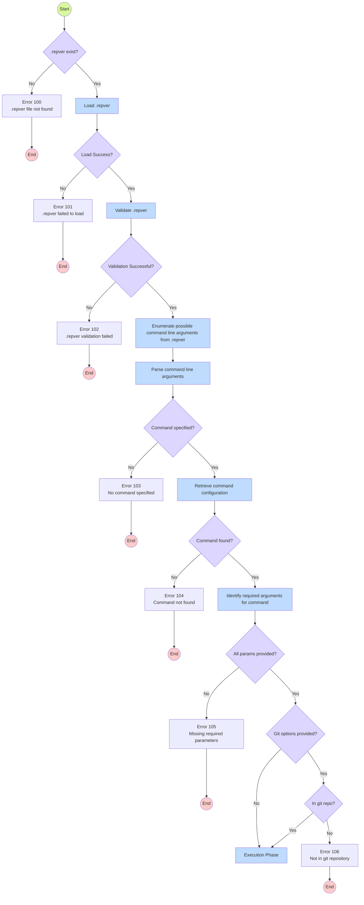

# Process Flow

The flowchar represents the internal process of the `repver` tool. It illustrates how the tool operates and the sequence of operations it performs to achieve its functionality.

## Initilization Phase

