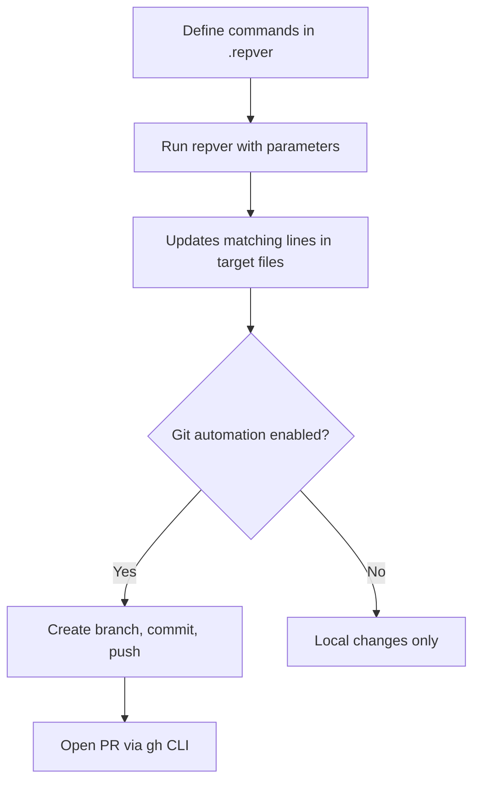

# repver

A command-line tool that automates batch replacement of strings—like version numbers—across multiple files in your repository, with optional Git automation to create branches, commit changes, and open pull requests.

## Why repver?

When you need to update version strings, configuration values, or other repeated patterns across multiple files, manually editing each file is tedious and error-prone. repver lets you define update commands once and run them consistently every time.

**Common use cases:**

- Updating language/runtime versions (Go, Node.js, Python) across build files and workflows
- Synchronizing version strings in documentation, Dockerfiles, and CI configs
- Managing any repeated value that needs to stay consistent across files

## How It Fits with Dependabot

Dependabot handles dependency updates automatically—but it doesn't touch version strings that you embed manually in files like `go.mod` comments, workflow YAML, or Dockerfiles.

**repver complements Dependabot** by handling the version strings that Dependabot can't see. Use Dependabot for your package dependencies and repver for your scattered version references.

## Basic Workflow



1. **Configure once**: Define commands in a `.repver` file at your repository root
2. **Run when needed**: Execute `repver --command=<name> --param-<name>=<value>`
3. **Automatic updates**: Matching lines are updated across all configured files
4. **Optional Git workflow**: Let repver create a branch, commit, push, and open a PR

## Quick Example

```bash
# Update Go version to 1.24.0 and create a PR
repver --command=goversion --param-version=1.24.0
```

For more detailed examples and scripting patterns, see the [Examples](./EXAMPLES.md) page.

## Next Steps

- [Command Reference](./COMMAND.md) – CLI flags and usage
- [Configuration](./CONFIGURATION.md) – How to set up your `.repver` file
- [Examples](./EXAMPLES.md) – Practical usage patterns and scripts
